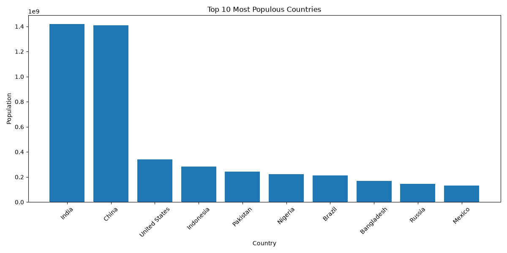
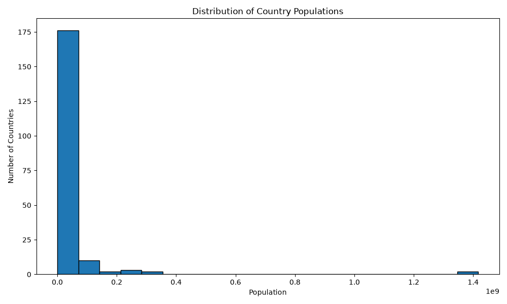

# 📊 SkillCraft Technology – Data Science Internship

## Task 01: Population Distribution Visualization

## 📌 Objective

The objective of this project is to analyze country-wise population data and create meaningful visualizations using Python. A bar chart is used to compare the top 10 most populous countries, while a histogram illustrates the overall distribution of population values.


## 📂 Dataset

This project uses the **`geo_population.csv`** dataset, which contains country-wise population statistics along with geographical information.

**Key columns used:**

* **Country** – Name of the country
* **Population** – Total population of the country


## 📈 Visualizations

### 1. Bar Chart – Top 10 Most Populous Countries

The bar chart compares the ten countries with the highest populations in the dataset.




### 2. Histogram – Population Distribution

The histogram illustrates the distribution of population values across all countries in the dataset.




## 📊 Key Insights

- India and China are the two most populous countries in the dataset.
- The top 10 countries account for a significant share of the world's population.
- The histogram shows that population is unevenly distributed across countries, with a few countries having extremely large populations while many have relatively smaller populations.
- The data exhibits a right-skewed distribution, indicating that only a small number of countries have populations exceeding hundreds of millions.


## 🛠️ Technologies Used

* Python
* Pandas
* Matplotlib
* Visual Studio Code
* Git & GitHub


## 📁 Project Structure

```text
SkillCraft_Task01/
├── output/
│   ├── bar_chart.png
│   └── histogram.png
├── geo_population.csv
├── task1.py
└── README.md
```


## 🎯 Learning Outcomes

Through this project, I gained practical experience in:

* Importing and analyzing CSV datasets using Pandas.
* Sorting and manipulating tabular data efficiently.
* Creating bar charts and histograms using Matplotlib.
* Saving visualizations as image files.
* Organizing and documenting a Python project using GitHub.


## 👤 Author

**Sreepriya**  
*Data Science Intern – SkillCraft Technology*


## 📜 License

This project is developed for educational purposes as part of the **SkillCraft Technology Data Science Internship**.